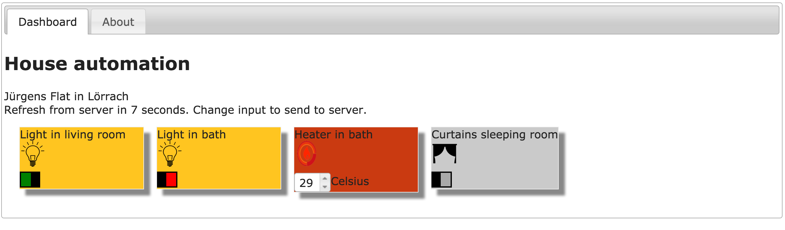

# HomeAutomation

				<article>
                    <header>
                        <h1>Adobe homework - Jürgen Toth</h1>
                    </header>
                    <main>
                        
<h2>Overview</h2>

                        <ul>
                            <li>Supported browsers: latest Firefox, Chrome</li>
                            <li>Responsive layout for different device resolutions</li>
                            <li>Central configuration file for all devices and for each device a data file</li>
                            <li>"public" directory created for hosting</li>
                        </ul>

                        
<h2>How to use</h2>

                        <ul>
                            <li>You need a internet connection, cause the jquery Files are linked over the CDN</li>
                            <li>Extract directory</li>
                            <li>run "npm install" in the directory (you need node.js)</li>
                            <li>run "node server.js"</li>
                            <li>Open "localhost:8080" in your browser</li>
                            <li>Alternative: deploy the "public" directory on your custom webserver</li>
                            <li>You can simulate server side value changes in updating the device file - eg. update "device_1.json" with the value "off</li>
                            <li>The dashboard automatically refreshes every 10 seconds and reloads the data values for each device</li>
                        </ul>

                        
<h2>Add new devices (from type heater, lightswitch or curtains) from your home to the dashboard</h2>

                        <ul>
                            <li>The file devices.json contains all active devices of your home, the individual device files holds the actual value</li>
                            <li>Add a new entry in "devices.json" from type "heater", "lightswitch" or "curtains"</li>
                            <li>Make sure the id is unique, you have to provide a image url and a dataurl (for updating the value from the widget)</li>
                            <li>Create the device json for storing the actual value of the device, e.g. "device_5.json"</li>
                            <li>Reload page in your browser</li>
                        </ul>

                        
<h2>Create new device types (other than heater, lightswitch or curtains)</h2>

                        <ul>
                            <li>Add as above described a new entry in devices.conf with a new device data file</li>
                            <li>Extend the client.js file with your new device type code:</li>
                            <li>Extend the "_setOption" function with your new device type (here you create the device element and implement hook the update action</li>
                            <li>Extend the "refresh" function with your new device type (here you can handle  server updates in your device type)</li>
                            <li>Style your new device type in style.css, use best the devicetype as selector</li>
                            <li>Reload page</li>
                        </ul>

                        
<h2>Tools/Frameworks used</h2>

                        <ul>
                            <li>CSS3 Flexbox</li>
                            <li>jQuery Widget Manager</li>
                            <li>jQuery / jQuery UI</li>
                            <li>JavaScript Revealing module pattern</li>
                            <li>NodeJS / Express for hosting (no server logic)</li>
                            <li>JetBrains WebStorms 2016.1 for development</li>
                        </ul>

                        
<h2>Extensions/Remarks</h2>

                        
                            When the callback functions are getting to large with many new device types, its's better to inject
                            the device type functions in the createWidgets function to keep the codebase readable.

                            The solution is without server side code (required restriction in homework description).
                            Without that restriction, the first optimization would be to use socket communication
                            with socket.io to keep every device widget up to date and to submit data to the server.

                            Another optimization would be a realtime JSON Database like firebase.com, every consumer
                            would be updated automatically in real time when data is changing. I use firebase
                            for my personal projects and publish about that a new article in the next
                            JavaSpektrum magazine 04/2016.

                            Jürgen Toth
                        
                    </main>
                </article>
			

